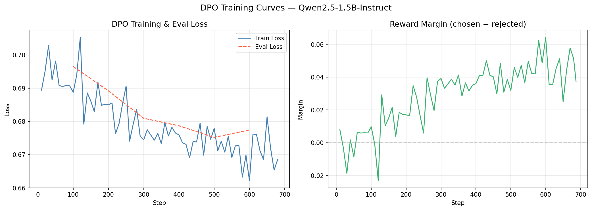
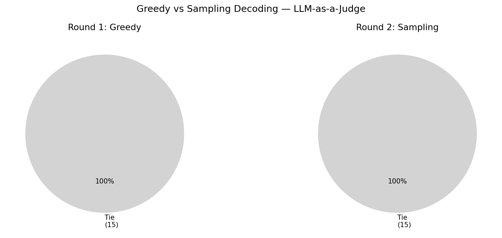

# NLU A5: Optimization Human Preference & LLM-as-a-Judge

| | |
|---|---|
| **Student** | Supanut Kompayak |
| **Student ID** | st126055 |
| **Course** | AT82.05 Natural Language Understanding |
| **Semester** | 2nd Semester, 2025–2026 |
| **Institute** | Asian Institute of Technology (AIT) |

---

## Overview

This assignment explores two critical aspects of modern LLM development: **Alignment** and **Evaluation**.

1. **Alignment**: Fine-tune `Qwen/Qwen2.5-1.5B-Instruct` using **Direct Preference Optimization (DPO)** with QLoRA 4-bit quantization on the `jondurbin/truthy-dpo-v0.1` dataset to make the model more truthful and avoid hallucinations.

2. **Evaluation**: Build an **LLM-as-a-Judge** pipeline using Gemini to compare the base model vs. the DPO-aligned model on the AlpacaEval benchmark.

---

## Tasks

### Task 1: Dataset Preparation (0.5 pt)
- **Dataset**: `jondurbin/truthy-dpo-v0.1`
- Format: `prompt`, `chosen` (factual), `rejected` (hallucinated/wrong)
- Explored dataset statistics and sample entries

### Task 2: DPO Training (2 pts)
- **Base Model**: `Qwen/Qwen2.5-1.5B-Instruct`
- **Method**: DPOTrainer (TRL) + QLoRA 4-bit (bitsandbytes + PEFT)
- Experimented with hyperparameters: `beta`, `learning_rate`, `epochs`
- Logged and plotted training/eval loss curves

### Task 3: Push to HuggingFace Hub (0.5 pt)
- Saved and uploaded fine-tuned adapter weights to HuggingFace Model Hub
- **Model**: [gossbu/qwen2.5-1.5b-dpo-truthy](https://huggingface.co/gossbu/qwen2.5-1.5b-dpo-truthy)

### Task 4: LLM-as-a-Judge with AlpacaEval (2 pts)
- **Eval Dataset**: `tatsu-lab/alpaca_eval` (helpful_base subset, 15 samples)
- Generated responses from both Base Model and DPO Model
- Used **Gemini** (`gemini-2.0-flash`) as the judge
- Calculated Win Rate for the DPO model

---

## Results

### Task 2: Training Hyperparameters

| Hyperparameter | Value |
|---|---|
| Base Model | Qwen/Qwen2.5-1.5B-Instruct |
| Dataset | jondurbin/truthy-dpo-v0.1 |
| Epochs | 3 |
| Learning Rate | 5e-7 |
| Beta (DPO) | 0.1 |
| Batch Size (per device) | 1 |
| LoRA Rank (r) | 64 |
| LoRA Alpha | 128 |
| Quantization | 4-bit NF4 (QLoRA) |

### Task 2: Training Results

| Metric | Value |
|---|---|
| Total Steps | 687 |
| Training Loss | 0.6785 |
| Runtime | ~1290s (~21.5 min) |
| GPU | NVIDIA RTX 5070 (12.8 GB VRAM) |
| Trainable Parameters | 11.9M / 1,555M (0.77%) |



### Task 4: LLM-as-a-Judge Evaluation

#### Round 1: Greedy Decoding (`do_sample=False`)

| Metric | Value |
|---|---|
| Model A (Base) Wins | 0 |
| Model B (DPO) Wins | 0 |
| Ties | 15 |
| Total Evaluations | 15 |
| **DPO Win Rate** | **50.0%** |

> All 15 outputs were identical (greedy decoding + subtle DPO distribution shift = same argmax token).

#### Round 2: Sampling Decoding (`temperature=0.7, top_p=0.9`)

| Metric | Value |
|---|---|
| Model A (Base) Wins | 0 |
| Model B (DPO) Wins | 0 |
| Ties | 15 |
| Total Evaluations | 15 |
| **DPO Win Rate** | **50.0%** |

> Outputs differed between Base and DPO (sampling made the distribution shift visible), but Gemini scored Ties due to comparable overall quality. Notable behavioral differences observed: DPO refused harmful prompts and avoided hallucinations (e.g., Sample 4 & 6).



---

## File Structure

```
A5/
├── assets/                         # Reference notebooks & assignment PDF
│   ├── 04-DPO.ipynb
│   ├── dpo-qlora-4bit.py
│   └── NLP_2026_A5_Human_Preference.pdf
├── notebooks/
│   └── st126055_Supanut_Kompayak_NLU_A5.ipynb  # Main notebook (Task 1-4)
├── screenshots/                    # Training plots & evaluation results
├── Dockerfile
├── docker-compose.yml
├── requirements.txt
└── README.md
```

---

## How to Run

```bash
# Set environment variables
export GEMINI_API_KEY="your_gemini_api_key"
export HF_TOKEN="your_huggingface_token"

# Using Docker (recommended)
docker-compose up --build

# Access JupyterLab:
# http://localhost:8888

# Or run directly with Python venv:
pip install -r requirements.txt
jupyter lab notebooks/
```

---

## References

1. Rafailov, R., et al. (2023). "Direct Preference Optimization: Your Language Model is Secretly a Reward Model." NeurIPS.
2. Dettmers, T., et al. (2023). "QLoRA: Efficient Finetuning of Quantized LLMs."
3. Hu, E., et al. (2022). "LoRA: Low-Rank Adaptation of Large Language Models."
4. HuggingFace TRL Documentation: https://huggingface.co/docs/trl/main/dpo_trainer
5. AlpacaEval: https://huggingface.co/datasets/tatsu-lab/alpaca_eval
6. Dataset: https://huggingface.co/datasets/jondurbin/truthy-dpo-v0.1

---

## Author

**Supanut Kompayak** (st126055) — Asian Institute of Technology, 2026
